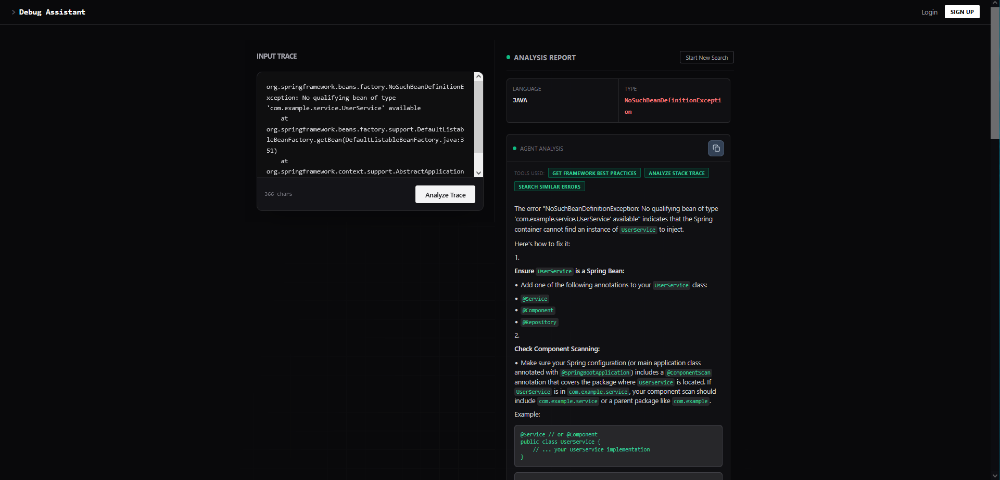

# DebugAssistant

DebugAssistant analyzes stack traces, extracts strong anchors (language / exception / message / keywords / root cause), and returns precision-first matches from GitHub Issues and Stack Overflow — better no results than "famous but wrong" links.

> Design principle: relevance over quantity (strict filtering by design).
> If a trace has no distinctive anchors, DebugAssistant will intentionally return 0 results.

---

## Demo



*Analyzing a Spring Boot NoSuchBeanDefinitionException. The system identified the exception, extracted relevant keywords, and found 15 solutions from Stack Overflow (5) and GitHub (10), ranked by relevance score.*

---

## Highlights

- Anchor extraction (exception-like tokens, dotted identifiers, code-like phrases) + noise filtering
- Precision-first ranking with strict drops (low-confidence results are removed)
- Stack Overflow uses layered query strategy (specific → broad) with answered/engagement weighting
- Redis cache for /api/analyze (normalized stack trace → MD5 key, TTL 24h)
- JWT-protected per-user history persisted in PostgreSQL
- OpenAPI/Swagger for fast API exploration

---

## Tech Stack

- Backend: Java, Spring Boot, Redis, PostgreSQL, OpenAPI/Swagger
- Frontend: React + Vite
- Infra: Docker + Docker Compose

---

## Frontend

React 19 + TypeScript with Vite.

**Structure:**
* `pages/` — Route-level views (Home, Login, Register, History)
* `components/` — Reusable UI (ResultCard, StackTraceInput, CopyButton, ErrorBoundary)
* `services/` — API client layer (analyzeService, authService, historyService)
* `context/` + `hooks/` — Auth state management (AuthContext, useAuth)

**Features:**
* Protected routes with JWT authentication
* Loading states and skeleton components
* Copy-to-clipboard for results
* Error boundaries for runtime error handling

**Testing:**
* Unit/Component tests: Vitest + Testing Library
* E2E tests: Playwright

---

## Quickstart (Docker)

### Start
```bash
cp .env.example .env
docker compose up --build
```

Access:
* Frontend: http://localhost:8081
* Backend: http://localhost:8080
* Swagger UI: http://localhost:8080/swagger-ui/index.html

### Analyze (public endpoint)
```bash
curl -s http://localhost:8080/api/analyze \
  -H "Content-Type: application/json" \
  -d '{"stackTrace":"org.springframework.boot.web.server.PortInUseException: Port 8080 is already in use"}'
```

### Stop
```bash
docker compose down
```

---

## Architecture

Parse stack trace → extract anchors → staged retrieval (GitHub + Stack Overflow) → rank & filter → cache response → (optional) persist run to user history.

---

## Relevance & Filtering

DebugAssistant extracts anchors and aggressively drops weak candidates.

Anchor types (examples):
* Exception-like tokens: PortInUseException, BadCredentialsException
* Dotted identifiers: org.springframework.web.HttpRequestMethodNotSupportedException
* Code-like phrases: Request method 'GET' not supported

Hard drops (by design):
* No meaningful anchors found in the trace → return 0 results.
* Drop any result with score < 0 (heuristic relevance score; keyword overlap carries the highest weight).

Output constraints:
* Return at most Top 15 results.

> Mini example:
> * Extracted anchors: PortInUseException, BindException, Address already in use
> * Candidate title: "Spring Boot PortInUseException: Port 8080 is already in use" → high score (keyword overlap)
> * Candidate title: "How to deploy Spring Boot" → low score (no keyword match)

---

## API

### Analyze (Public)
POST /api/analyze
Works without auth. If a user is logged in via JWT, the run is also written to history.

Request:
```json
{
  "stackTrace": "..."
}
```

Response includes:
* language, exceptionType, message, keywords, rootCause
* results[] (GitHub and Stack Overflow links + ranking fields)

> See Swagger UI (/swagger-ui/index.html) for the exact schema.

### History (JWT-protected)
* GET /api/history (list past analyses)
* POST /api/history (optional manual save; auto-saved on analyze when authenticated)

Stored per user:
* stackTraceSnippet (max 500 chars)
* language, exceptionType
* searchUrl (top match)
* searchedAt, userId

---

## Caching (Redis)

* Cache name: analyses
* Key: MD5(normalizedStackTrace) where normalization is trim + CRLF → LF
* TTL: 24 hours

Clear cache (useful after ranking changes):
```bash
docker compose exec redis redis-cli FLUSHDB
```

---

## Configuration (.env)

Required keys (names only):
```properties
GITHUB_API_TOKEN
JWT_SECRET_KEY
JWT_EXPIRATION
SPRING_DATASOURCE_URL
SPRING_DATASOURCE_USERNAME
SPRING_DATASOURCE_PASSWORD
SPRING_DATA_REDIS_HOST
SPRING_DATA_REDIS_PORT
```

---

## Result Quality

DebugAssistant searches Stack Overflow and GitHub using the exception name combined with keywords from the error message. Result quality depends on how **distinctive** these search terms are.

### What works well

Stack traces with specific, unique exception names. Exceptions like `LazyInitializationException` or `TransientPropertyValueException` are rare enough that searching for them returns precise matches.

These exceptions share common traits:
* The name describes a specific framework/library problem, not a general Java concept
* The error message contains technical terms unique to that library
* Searching the exception name alone often yields relevant results

### What works less well

Stack traces with generic exception names like `SQLException`, `IOException`, or `RuntimeException`. These names cover hundreds of different root causes, and their error messages often contain common words ("connection", "refused", "failed", "timeout") that match thousands of unrelated questions.

The same applies to wrapper exceptions like `HttpMessageNotReadableException` — the real cause is usually nested in the `Caused by:` chain, and the wrapper name is too broad to produce useful search results.

### Why this matters

The tool builds search queries from your stack trace. A query like `LazyInitializationException no Session` is specific enough to return precise matches. A query like `SQLException connection refused` matches everything from database configuration to network issues — too broad to be useful.

> Tip: If results are poor, look for a more specific nested exception in the `Caused by:` chain.

---

## Demo Stack Traces

### Spring: NoSuchBeanDefinitionException
```java
org.springframework.beans.factory.NoSuchBeanDefinitionException: No qualifying bean of type 'com.example.service.UserService' available: expected at least 1 bean which qualifies as autowire candidate. Dependency annotations: {@org.springframework.beans.factory.annotation.Autowired(required=true)}
at org.springframework.beans.factory.support.DefaultListableBeanFactory.raiseNoMatchingBeanFound(DefaultListableBeanFactory.java:1799)
at org.springframework.beans.factory.support.DefaultListableBeanFactory.doResolveDependency(DefaultListableBeanFactory.java:1355)
at org.springframework.beans.factory.support.DefaultListableBeanFactory.resolveDependency(DefaultListableBeanFactory.java:1309)
at org.springframework.beans.factory.annotation.AutowiredAnnotationBeanPostProcessor$AutowiredFieldElement.resolveFieldValue(AutowiredAnnotationBeanPostProcessor.java:660)
at com.example.controller.UserController.(UserController.java:24)
```

### Hibernate: LazyInitializationException
```java
org.hibernate.LazyInitializationException: failed to lazily initialize a collection of role: com.example.entity.User.orders, could not initialize proxy - no Session
at org.hibernate.collection.internal.AbstractPersistentCollection.throwLazyInitializationException(AbstractPersistentCollection.java:612)
at org.hibernate.collection.internal.AbstractPersistentCollection.withTemporarySessionIfNeeded(AbstractPersistentCollection.java:218)
at org.hibernate.collection.internal.AbstractPersistentCollection.initialize(AbstractPersistentCollection.java:591)
at org.hibernate.collection.internal.PersistentBag.iterator(PersistentBag.java:387)
at com.example.service.OrderService.getOrdersByUser(OrderService.java:45)
at com.example.controller.OrderController.getUserOrders(OrderController.java:32)
```

### Hibernate: TransientPropertyValueException
```java
org.hibernate.TransientPropertyValueException: object references an unsaved transient instance - save the transient instance before flushing : com.example.entity.Order.customer -> com.example.entity.Customer
at org.hibernate.engine.spi.CascadingActions$8.noCascade(CascadingActions.java:379)
at org.hibernate.engine.internal.Cascade.cascade(Cascade.java:163)
at org.hibernate.event.internal.AbstractFlushingEventListener.cascadeOnFlush(AbstractFlushingEventListener.java:163)
at org.hibernate.event.internal.DefaultFlushEntityEventListener.onFlushEntity(DefaultFlushEntityEventListener.java:213)
at com.example.service.OrderService.createOrder(OrderService.java:28)
```

### Spring: BeanCurrentlyInCreationException
```java
org.springframework.beans.factory.BeanCurrentlyInCreationException: Error creating bean with name 'serviceA': Requested bean is currently in creation: Is there an unresolvable circular reference?
at org.springframework.beans.factory.support.DefaultSingletonBeanRegistry.beforeSingletonCreation(DefaultSingletonBeanRegistry.java:355)
at org.springframework.beans.factory.support.DefaultSingletonBeanRegistry.getSingleton(DefaultSingletonBeanRegistry.java:227)
at org.springframework.beans.factory.support.AbstractBeanFactory.doGetBean(AbstractBeanFactory.java:324)
at com.example.config.AppConfig.serviceA(AppConfig.java:23)
```

### Jackson: InvalidFormatException
```java
com.fasterxml.jackson.databind.exc.MismatchedInputException: Cannot deserialize value of type `java.lang.Integer` from String "abc": not a valid Integer value
at com.fasterxml.jackson.databind.exc.InvalidFormatException.from(InvalidFormatException.java:67)
at com.fasterxml.jackson.databind.DeserializationContext.weirdStringException(DeserializationContext.java:2021)
at com.fasterxml.jackson.databind.deser.std.StdDeserializer._parseInteger(StdDeserializer.java:2230)
at com.fasterxml.jackson.databind.deser.std.NumberDeserializers$IntegerDeserializer.deserialize(NumberDeserializers.java:247)
at com.example.controller.ProductController.updatePrice(ProductController.java:45)
```

---

## Security & Privacy

* JWT protects history endpoints.
* Stored in history: Only stackTraceSnippet (max 500 chars) + derived fields + top URL + timestamps/user linkage.
* Not stored: Full raw stack traces, environment secrets, access tokens.
* Current state: Automatic redaction before persistence is planned but not implemented yet.

---

## Failure Strategy & Limitations

Failure strategy:
External calls are best effort. If GitHub or Stack Overflow fails (timeouts/rate limits), the API returns fewer/empty results; parsing/validation errors still return 4xx.

Limitations (intentional):
* Precision-first: Generic traces often return 0 results.
* Strict SO filtering: Reduces noise but can exclude some valid threads.
* Results depend on external API availability.

---

## Tests
```bash
mvn test
```
* Controller/integration tests via @SpringBootTest + MockMvc.
* External clients (GitHub / Stack Overflow) are mocked.

---

## Roadmap

* [ ] UI result previews (GitHub/SO excerpts)
* [ ] History UX: search, filters, pagination, re-run
* [ ] Shareable read-only reports (/r/{id})
* [ ] Redaction before persistence (mask tokens/URLs/IPs)
* [ ] Optional: curated evaluation set + precision-focused metrics
* [ ] Semantic reranking (embeddings) after heuristics are stable