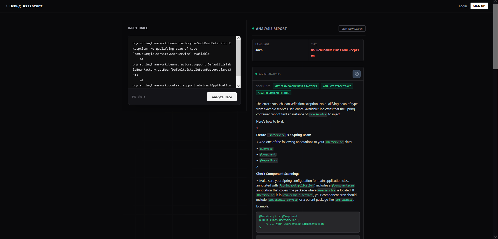

# DebugAssistant

Semantic search for debugging using BERT embeddings and FAISS vector similarity.

Finds relevant Stack Overflow and GitHub solutions by understanding stack traces semantically. Uses rule-based preprocessing to extract key terms, then BERT embeddings for semantic matching—finding "race condition null reference" when you search "async NPE".

An LLM-powered debug agent autonomously selects tools (stack trace analysis, semantic search, framework best practices) to generate actionable solutions.

> Architecture: Java backend for trace parsing + Python ML service for semantic search (BERT + FAISS) + LLM agent (Gemini)

> Design principle: relevance over quantity (strict filtering by design).
> If a trace has no distinctive anchors, DebugAssistant will intentionally return 0 results.

---

## Demo



*Analyzing a Spring Boot NoSuchBeanDefinitionException. The system identified the exception, extracted relevant keywords, and found 15 solutions from Stack Overflow (5) and GitHub (10), ranked by relevance score.*

---

## Highlights

- BERT embeddings (sentence-transformers) for semantic similarity matching
- FAISS vector search with 3-6ms retrieval on 50 curated traces
- LLM debug agent with autonomous tool selection (Gemini)
- Rule-based anchor extraction (exception types, packages, keywords)
- Precision-first ranking with strict drops (low-confidence results removed)
- Stack Overflow uses layered query strategy (specific → broad) with answered/engagement weighting
- Redis cache for /api/analyze (normalized stack trace → MD5 key, TTL 24h)
- JWT-protected per-user history persisted in PostgreSQL
- OpenAPI/Swagger for fast API exploration

---

## Tech Stack

**ML Service (Python):**
- Embeddings: sentence-transformers (all-MiniLM-L6-v2)
- Vector Search: FAISS (IndexFlatIP, exact search)
- LLM: Google Gemini API (gemini-2.5-flash-lite)
- Agent: Tool-calling loop with autonomous tool selection
- API: FastAPI
- Dataset: 50 curated Java exception traces

**Backend:** Java 21, Spring Boot, Redis, PostgreSQL, OpenAPI/Swagger  
**Frontend:** React 19 + TypeScript, Vite  
**Infrastructure:** Docker Compose

---

## Architecture

Two-layer system: Java backend for preprocessing + Python ML service for semantic search and LLM agent.

### Pipeline
```
Stack Trace
    ↓
[Java Backend] Rule-based anchor extraction
    ↓ (exception names, packages, keywords)
[Python ML Service] BERT embedding generation
    ↓ (384-dim vectors)
[FAISS Index] Vector similarity search
    ↓ (cosine similarity)
Ranked Results (Top-K most similar traces)
    ↓
[Java Backend] Cache (Redis) + History (PostgreSQL)
```

### Debug Agent Pipeline
```
Stack Trace
    ↓
[Gemini LLM] Decides which tools to call
    ↓
┌─────────────────────┬──────────────────────┬─────────────────────────────┐
│ analyze_stack_trace  │ search_similar_errors│ get_framework_best_practices│
│ (extract exception,  │ (FAISS semantic      │ (Spring Boot, Hibernate,    │
│  framework, cause)   │  search over index)  │  Jackson guidance)          │
└─────────────────────┴──────────────────────┴─────────────────────────────┘
    ↓ (tool results fed back to LLM)
[Gemini LLM] Synthesizes final analysis with concrete fixes
```

### Components

**1. Anchor Extraction (Java/Regex)**

Pattern matching extracts structured information:
- Exception types: `NoSuchBeanDefinitionException`, `LazyInitializationException`
- Package paths: `org.springframework.beans.factory.*`
- Framework keywords: Spring Boot, Hibernate
- Code-like phrases: `UserService` bean not found

Why this matters: Generic search on "error" returns millions of results. Anchor extraction identifies the 5-10 distinctive terms that actually describe the problem.

**2. Semantic Search (Python/ML)**

**Model:** sentence-transformers/all-MiniLM-L6-v2
- 384 dimensions
- ~90MB model size
- ~400ms embedding time (CPU)

**FAISS Index:** IndexFlatIP (exact search)
- 50 indexed traces (demo dataset)
- L2 normalization for cosine similarity
- 3-6ms search time (measured)

**Note:** Embedding time could be reduced to <50ms with GPU acceleration or ONNX optimization. Current implementation prioritizes simplicity over speed.

**3. Debug Agent (Python/Gemini)**

LLM-powered agent that autonomously decides which tools to use for each stack trace:
- `analyze_stack_trace` — Extract exception type, framework, root cause
- `search_similar_errors` — FAISS semantic search over curated error patterns
- `get_framework_best_practices` — General debugging guidance per framework

The agent uses a simple tool-calling loop with the Google Gemini API (gemini-2.5-flash-lite). The LLM receives the stack trace, calls tools as needed, and synthesizes a structured analysis with concrete fixes.

Implementation uses the google-genai SDK directly (without LangGraph) to ensure correct message ordering for Gemini's strict function-calling protocol.

**4. Ranking & Filtering**

Precision-first approach:
- Similarity threshold: 0.3 (drop low-confidence matches)
- Return top-K results (typically 5-15)
- Better 0 results than wrong results

Hybrid scoring combines:
- Semantic similarity (FAISS cosine score)
- Keyword overlap
- Source quality (SO: answered + votes, GH: stars + comments)

---

## Demo Dataset

**50 curated Java exception traces** covering:
- Spring Boot (17): Bean configuration, dependency injection, port conflicts
- Hibernate/JPA (13): Lazy initialization, transactions, mappings
- Java Core (13): NullPointer, ArrayIndex, ClassNotFound, OutOfMemory
- Jackson (7): Serialization, parsing errors

**Data Curation:**
1. Generated representative traces for common exception patterns
2. Manually verified Stack Overflow solution links (50+ upvotes, accepted answers)
3. Embedded with BERT and indexed in FAISS

**Production Note:** Infrastructure designed to scale to millions of traces. Demo uses curated subset for reproducible evaluation and reliable demos.

**Example Search:**
```bash
Query: "autowired bean not found"
→ BERT embedding → FAISS search
→ Returns: Spring dependency injection solutions (NoSuchBeanDefinitionException)

Query: "lazy initialization failed"
→ BERT embedding → FAISS search
→ Returns: Hibernate session management patterns (LazyInitializationException)
```

---

## Frontend

React 19 + TypeScript with Vite.

**Structure:**
* `pages/` — Route-level views (Home, Login, Register, History)
* `components/` — Reusable UI (ResultCard, StackTraceInput, CopyButton, ErrorBoundary)
* `services/` — API client layer (analyzeService, authService, historyService)
* `context/` + `hooks/` — Auth state management (AuthContext, useAuth)

**Features:**
* Protected routes with JWT authentication
* Loading states and skeleton components
* Copy-to-clipboard for results
* Error boundaries for runtime error handling

**Testing:**
* Unit/Component tests: Vitest + Testing Library
* E2E tests: Playwright

---

## Quickstart (Docker)

### Prerequisites

- Docker and Docker Compose
- Gemini API Key (free from [Google AI Studio](https://aistudio.google.com/apikey), no credit card required)

### Start
```bash
cp .env.example .env
# Edit .env and add GEMINI_API_KEY

# FAISS index already included in repository
docker compose up --build
```

Access:
* Frontend: http://localhost:8081
* Backend: http://localhost:8080
* ML Service: http://localhost:8000
* Swagger UI: http://localhost:8080/swagger-ui/index.html

### Analyze (public endpoint)
```bash
curl -s http://localhost:8080/api/analyze \
  -H "Content-Type: application/json" \
  -d '{"stackTrace":"org.springframework.boot.web.server.PortInUseException: Port 8080 is already in use"}'
```

### Stop
```bash
docker compose down
```

---

## Relevance & Filtering

DebugAssistant extracts anchors and aggressively drops weak candidates.

Anchor types (examples):
* Exception-like tokens: PortInUseException, BadCredentialsException
* Dotted identifiers: org.springframework.web.HttpRequestMethodNotSupportedException
* Code-like phrases: Request method 'GET' not supported

Hard drops (by design):
* No meaningful anchors found in the trace → return 0 results.
* Drop any result with FAISS similarity score < 0.3
* Drop any result with combined relevance score < 0

Output constraints:
* Return at most Top 15 results.

> Mini example:
> * Extracted anchors: PortInUseException, BindException, Address already in use
> * BERT embedding generated → FAISS search
> * Candidate title: "Spring Boot PortInUseException: Port 8080 is already in use" → high score (semantic + keyword match)
> * Candidate title: "How to deploy Spring Boot" → low score (no semantic match)

---

## API

### Analyze (Public)
POST /api/analyze
Works without auth. If a user is logged in via JWT, the run is also written to history.

Request:
```json
{
  "stackTrace": "..."
}
```

Response includes:
* language, exceptionType, message, keywords, rootCause
* results[] (GitHub and Stack Overflow links + ranking fields)
* mlAnalysis (String, LLM-generated explanation if GEMINI_API_KEY configured)

> See Swagger UI (/swagger-ui/index.html) for the exact schema.

### History (JWT-protected)
* GET /api/history (list past analyses)
* POST /api/history (optional manual save; auto-saved on analyze when authenticated)

Stored per user:
* stackTraceSnippet (max 500 chars)
* language, exceptionType
* searchUrl (top match)
* searchedAt, userId

---

## Caching (Redis)

* Cache name: analyses
* Key: MD5(normalizedStackTrace) where normalization is trim + CRLF → LF
* TTL: 24 hours

Clear cache (useful after ranking changes):
```bash
docker compose exec redis redis-cli FLUSHDB
```

---

## Configuration (.env)

Required keys:
```properties
GEMINI_API_KEY
GITHUB_API_TOKEN
JWT_SECRET_KEY
JWT_EXPIRATION
SPRING_DATASOURCE_URL
SPRING_DATASOURCE_USERNAME
SPRING_DATASOURCE_PASSWORD
SPRING_DATA_REDIS_HOST
SPRING_DATA_REDIS_PORT
```

---

## Result Quality

DebugAssistant uses semantic search (BERT embeddings) combined with keyword matching. Result quality depends on how **distinctive** the extracted anchors are.

### What works well

Stack traces with specific, unique exception names. Exceptions like `LazyInitializationException` or `TransientPropertyValueException` are rare enough that their embeddings cluster tightly with relevant solutions.

These exceptions share common traits:
* The name describes a specific framework/library problem, not a general Java concept
* The error message contains technical terms unique to that library
* BERT embeddings capture the semantic relationship to solution text

### What works less well

Stack traces with generic exception names like `SQLException`, `IOException`, or `RuntimeException`. These names cover hundreds of different root causes, and their embeddings are less distinctive.

The same applies to wrapper exceptions like `HttpMessageNotReadableException` — the real cause is usually nested in the `Caused by:` chain, and the wrapper name is too broad to produce useful embeddings.

### Why this matters

The system generates BERT embeddings from extracted anchors. An embedding from `LazyInitializationException no Session` is specific enough to find precise matches. An embedding from `SQLException connection refused` is too generic to distinguish between database configuration, network issues, or driver problems.

> Tip: If results are poor, look for a more specific nested exception in the `Caused by:` chain.

---

## Engineering Decisions

### BERT Embeddings vs Keyword Search

**Choice:** Use BERT embeddings for semantic similarity

**Why:**
- Developers phrase same error differently: "NPE", "null pointer", "calling method on null"
- BERT captures semantic similarity across phrasings
- Example: "LazyInitializationException" and "proxy initialization failed" → cosine similarity ~0.78

**Trade-off:**
- Slower than pure keyword search (400ms embedding time on CPU)
- Requires ML infrastructure (model, FAISS index)
- Better precision: finds semantically similar solutions even with different wording

**Future optimization:** GPU acceleration or ONNX could reduce to <50ms

### IndexFlatIP (Exact Search)

**Choice:** FAISS IndexFlatIP instead of approximate methods (IndexIVF, IndexHNSW)

**Why:**
- Demo has 50 vectors → exact search is faster (~5ms vs ~20ms overhead)
- 100% accuracy (no approximation errors)
- Simple implementation

**Trade-off:**
- Does not scale to millions (would need IndexIVF for >100k vectors)
- Production system would migrate to approximate search for scale

### Rule-Based Preprocessing

**Choice:** Java regex for anchor extraction, not transformer-based NER

**Why:**
- Stack traces are highly structured (exception names, packages follow Java naming conventions)
- Regex patterns capture this structure reliably (~99% accuracy)
- 100x faster than transformer inference (~1ms vs ~100ms)

**Trade-off:**
- Misses semantic variations ("NPE" as shorthand not captured)
- Brittle to unexpected formats
- Future: Could add learned extraction for edge cases

### Gemini SDK over LangGraph

**Choice:** Direct google-genai SDK with manual tool-calling loop instead of LangGraph

**Why:**
- Gemini requires strict message ordering (function response must immediately follow function call)
- LangGraph inserts extra messages that break this ordering
- Direct SDK gives full control over the conversation structure

**Trade-off:**
- More manual code for the tool-calling loop
- No built-in state management from LangGraph
- But: simpler, fewer dependencies, and actually works reliably with Gemini

---

## Demo Stack Traces

### Spring: NoSuchBeanDefinitionException
```java
org.springframework.beans.factory.NoSuchBeanDefinitionException: No qualifying bean of type 'com.example.service.UserService' available: expected at least 1 bean which qualifies as autowire candidate. Dependency annotations: {@org.springframework.beans.factory.annotation.Autowired(required=true)}
at org.springframework.beans.factory.support.DefaultListableBeanFactory.raiseNoMatchingBeanFound(DefaultListableBeanFactory.java:1799)
at org.springframework.beans.factory.support.DefaultListableBeanFactory.doResolveDependency(DefaultListableBeanFactory.java:1355)
at org.springframework.beans.factory.support.DefaultListableBeanFactory.resolveDependency(DefaultListableBeanFactory.java:1309)
at org.springframework.beans.factory.annotation.AutowiredAnnotationBeanPostProcessor$AutowiredFieldElement.resolveFieldValue(AutowiredAnnotationBeanPostProcessor.java:660)
at com.example.controller.UserController.(UserController.java:24)
```

### Hibernate: LazyInitializationException
```java
org.hibernate.LazyInitializationException: failed to lazily initialize a collection of role: com.example.entity.User.orders, could not initialize proxy - no Session
at org.hibernate.collection.internal.AbstractPersistentCollection.throwLazyInitializationException(AbstractPersistentCollection.java:612)
at org.hibernate.collection.internal.AbstractPersistentCollection.withTemporarySessionIfNeeded(AbstractPersistentCollection.java:218)
at org.hibernate.collection.internal.AbstractPersistentCollection.initialize(AbstractPersistentCollection.java:591)
at org.hibernate.collection.internal.PersistentBag.iterator(PersistentBag.java:387)
at com.example.service.OrderService.getOrdersByUser(OrderService.java:45)
at com.example.controller.OrderController.getUserOrders(OrderController.java:32)
```

### Hibernate: TransientPropertyValueException
```java
org.hibernate.TransientPropertyValueException: object references an unsaved transient instance - save the transient instance before flushing : com.example.entity.Order.customer -> com.example.entity.Customer
at org.hibernate.engine.spi.CascadingActions$8.noCascade(CascadingActions.java:379)
at org.hibernate.engine.internal.Cascade.cascade(Cascade.java:163)
at org.hibernate.event.internal.AbstractFlushingEventListener.cascadeOnFlush(AbstractFlushingEventListener.java:163)
at org.hibernate.event.internal.DefaultFlushEntityEventListener.onFlushEntity(DefaultFlushEntityEventListener.java:213)
at com.example.service.OrderService.createOrder(OrderService.java:28)
```

### Spring: BeanCurrentlyInCreationException
```java
org.springframework.beans.factory.BeanCurrentlyInCreationException: Error creating bean with name 'serviceA': Requested bean is currently in creation: Is there an unresolvable circular reference?
at org.springframework.beans.factory.support.DefaultSingletonBeanRegistry.beforeSingletonCreation(DefaultSingletonBeanRegistry.java:355)
at org.springframework.beans.factory.support.DefaultSingletonBeanRegistry.getSingleton(DefaultSingletonBeanRegistry.java:227)
at org.springframework.beans.factory.support.AbstractBeanFactory.doGetBean(AbstractBeanFactory.java:324)
at com.example.config.AppConfig.serviceA(AppConfig.java:23)
```

### Jackson: InvalidFormatException
```java
com.fasterxml.jackson.databind.exc.MismatchedInputException: Cannot deserialize value of type `java.lang.Integer` from String "abc": not a valid Integer value
at com.fasterxml.jackson.databind.exc.InvalidFormatException.from(InvalidFormatException.java:67)
at com.fasterxml.jackson.databind.DeserializationContext.weirdStringException(DeserializationContext.java:2021)
at com.fasterxml.jackson.databind.deser.std.StdDeserializer._parseInteger(StdDeserializer.java:2230)
at com.fasterxml.jackson.databind.deser.std.NumberDeserializers$IntegerDeserializer.deserialize(NumberDeserializers.java:247)
at com.example.controller.ProductController.updatePrice(ProductController.java:45)
```

---

## Security & Privacy

* JWT protects history endpoints.
* Stored in history: Only stackTraceSnippet (max 500 chars) + derived fields + top URL + timestamps/user linkage.
* Not stored: Full raw stack traces, environment secrets, access tokens.
* Current state: Automatic redaction before persistence is planned but not implemented yet.

---

## Failure Strategy & Limitations

Failure strategy:
External calls are best effort. If GitHub or Stack Overflow fails (timeouts/rate limits), the API returns fewer/empty results; parsing/validation errors still return 4xx. If ML service is unavailable, system falls back to keyword-only search.

Limitations (intentional):
* Precision-first: Generic traces often return 0 results.
* Strict filtering: Reduces noise but can exclude some valid matches.
* Results depend on external API availability and ML service uptime.
* Demo dataset limited to 50 traces (production would index millions).

---

## Tests
```bash
mvn test                    # Backend tests
cd ml-service && pytest     # ML service tests
cd frontend && npm test     # Frontend tests
```
* Controller/integration tests via @SpringBootTest + MockMvc.
* External clients (GitHub / Stack Overflow) are mocked.
* ML service: unit tests for embedding, similarity search, and RAG pipeline.
* Frontend: Vitest + Playwright.

---

## Project Structure
```
debugassistant/
├── ml-service/           # Python ML microservice
│   ├── app/
│   │   ├── services/     # BERT, FAISS, RAG, debug agent
│   │   └── main.py       # FastAPI app
│   ├── data/             # FAISS index, sample traces
│   ├── scripts/          # build_index.py
│   └── requirements.txt
├── src/                  # Java Spring Boot backend
│   └── main/java/...     # Controllers, services, security
├── frontend/             # React app
│   ├── src/
│   │   ├── pages/
│   │   ├── components/
│   │   └── services/
│   └── tests/
├── docker-compose.yml
└── README.md
```

---

## Roadmap

### Phase 1: Core Features (Completed)
- BERT embeddings and FAISS search
- Demo dataset (50 curated traces)
- Full-stack UI
- JWT authentication
- Redis caching
- Debug agent with autonomous tool selection
- Google Gemini API integration

### Phase 2: Production Readiness (Planned)
- Batch ingestion pipeline (Stack Overflow API, GitHub API)
- Incremental index updates
- IndexIVF for >100k vectors
- GPU/ONNX optimization for faster embedding
- Monitoring and metrics (Prometheus)
- A/B testing framework for ranking

### Phase 3: Advanced Features (Future)
- Multi-language support (Python, JavaScript traces)
- Transformer-based anchor extraction (replace regex)
- Custom embedding fine-tuning on developer Q&A
- Explanation highlighting (which part of trace matched)
- Shareable read-only reports (/r/{id})

---

## License

MIT License

---

## Acknowledgments

- Sentence Transformers for BERT embeddings
- FAISS for vector similarity search
- Google Gemini for LLM-powered analysis
- Stack Overflow community for curated solutions