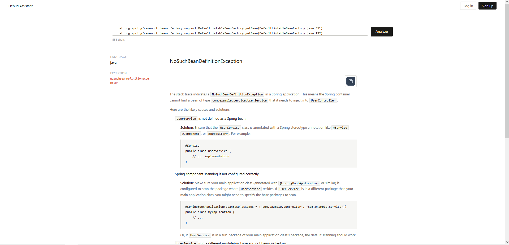

# DebugAssistant

[](https://github.com/danielsamo-se/debugassistant/actions/workflows/backend-ci.yml)
[](https://github.com/danielsamo-se/debugassistant/actions/workflows/frontend-ci.yml)
[](https://github.com/danielsamo-se/debugassistant/actions/workflows/ml-service-ci.yml)

DebugAssistant analyzes stack traces using semantic search and an LLM debug agent. It matches errors against 50 curated error patterns using Sentence-BERT embeddings and FAISS, then an autonomous Gemini agent selects tools to generate structured explanations. GitHub Issues and Stack Overflow are queried in parallel using Java 21 virtual threads and CompletableFuture.

---

## Demo



---

## Architecture

Stack trace → Spring Boot parses and extracts anchors → ML Service encodes with Sentence-BERT and searches FAISS index → Gemini agent autonomously selects tools and generates explanation → results cached in Redis → optionally saved to PostgreSQL per user

The backend runs a parallel heuristic search against GitHub Issues and Stack Overflow using CompletableFuture with virtual threads, reducing retrieval latency by ~33% compared to sequential execution.

---

## Highlights

- Sentence-BERT embeddings (all-MiniLM-L6-v2) with FAISS IndexFlatIP, cosine similarity via L2 normalization
- LLM debug agent with autonomous tool calling (Gemini 2.5 Flash)
- Parallel GitHub Issues + Stack Overflow retrieval via CompletableFuture and Java 21 virtual threads
- Retrieval benchmark: Hit@1 0.88 vs 0.68 TF-IDF baseline on 50 manually designed queries
- Redis cache with MD5 key and 24h TTL
- Rate limiting: 60 requests/min per IP via Redis Lua script (fixed-window)
- JWT-protected per-user history in PostgreSQL

---

## Tech Stack

- **ML Service:** Python, FastAPI, Sentence-Transformers, FAISS, Google Gemini
- **Backend:** Java 21, Spring Boot, Redis, PostgreSQL
- **Frontend:** React 19, TypeScript, Vite
- **Infra:** Docker Compose (5 containers)

---

## ML Service

FastAPI microservice for semantic search and LLM-based analysis.

**Semantic Search:** 50 curated error patterns embedded with all-MiniLM-L6-v2 (384 dimensions) and stored in a FAISS index. At query time the stack trace is encoded with the same model and the top-k most similar patterns are retrieved.

**Debug Agent:** The agent receives a stack trace and runs a tool-calling loop with Gemini 2.5 Flash. It autonomously selects from 3 tools:
- `analyze_stack_trace` — extracts exception type, framework and root cause
- `search_similar_errors` — searches the FAISS index for similar error patterns
- `get_framework_best_practices` — returns common fixes for Spring, Hibernate or Jackson

**Endpoints:**
- `POST /search` — semantic search against FAISS index
- `POST /analyze` — full agent analysis
- `GET /health` — health check

---

## Evaluation

Retrieval benchmark in `ml-service/evaluation.ipynb` with 50 manually designed Java and Spring debugging queries.

- Sentence-BERT + FAISS: Hit@1 0.88, Hit@3 0.98, MRR 0.927
- TF-IDF baseline: Hit@1 0.68, Hit@3 0.86, MRR 0.763
- Top-1 retrieval improved from 34/50 to 44/50
- Complete misses in top 3 reduced from 7 to 1

---

## Frontend

React 19 + TypeScript with Vite.

- `pages/` — Route-level views (Home, Login, Register, History)
- `components/` — ResultCard, StackTraceInput, CopyButton, ErrorBoundary
- `services/` — API client layer
- `context/` + `hooks/` — Auth state management

Testing: Vitest + Testing Library (unit/component), Playwright (E2E)

---

## Quickstart (Docker)

```bash
cp .env.example .env
docker compose up --build
```

- Frontend: http://localhost:8081
- Backend: http://localhost:8080
- Swagger UI: http://localhost:8080/swagger-ui/index.html

---

## API

### Analyze

`POST /api/v1/analyze` — works without auth. Rate limited to 60 requests/min per IP via Redis (429 + `Retry-After` header when exceeded). If authenticated via JWT, the run is saved to history.

```json
{
  "stackTrace": "..."
}
```

### History (JWT-protected)

- `GET /api/history` — list past analyses
- `POST /api/history` — auto-saved on analyze when authenticated

---

## Configuration (.env)

```
GEMINI_API_KEY
GITHUB_API_TOKEN
JWT_SECRET_KEY
JWT_EXPIRATION
SPRING_DATASOURCE_URL
SPRING_DATASOURCE_USERNAME
SPRING_DATASOURCE_PASSWORD
SPRING_DATA_REDIS_HOST
SPRING_DATA_REDIS_PORT
VITE_API_BASE
```

---

## Tests

```bash
mvn test                    # Backend (145 tests)
cd ml-service && pytest     # ML service
cd frontend && npx vitest run  # Frontend
```
